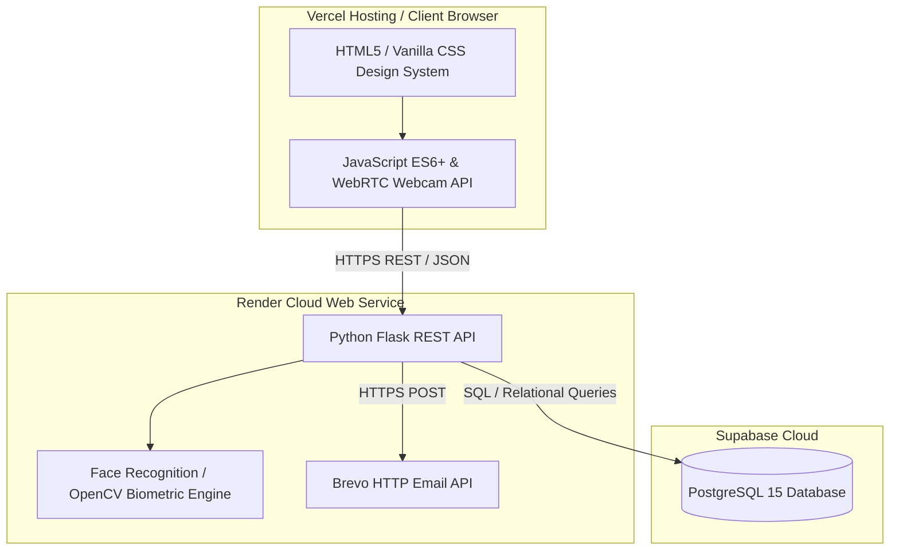
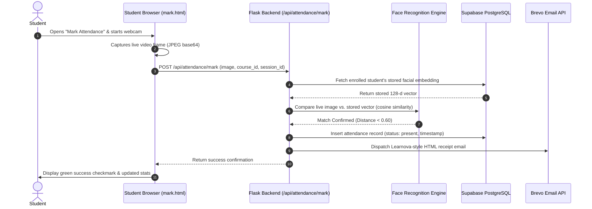

# AttendX AI-Powered Biometric Attendance & Classroom Management System
## Complete Project Report & Technical Overview

---

## 1. Executive Summary
**AttendX** is a modern, end-to-end web application that revolutionizes educational attendance tracking by replacing manual roll-calls and basic sign-in sheets with **AI-powered facial recognition** and **dynamic session verification**. 

Built with a high-performance **Python/Flask** backend, a responsive **Vanilla CSS/JS** frontend, and a cloud-native **Supabase (PostgreSQL)** database, AttendX guarantees secure, tamper proof attendance marking while delivering a sleek, dark-themed user experience for **Students**, **Teachers**, and **Administrators**.

---

## 2. What We Used — Technology Stack

### **Core Stack Details**
| Layer | Technology | Key Purpose & Highlights |
| :--- | :--- | :--- |
| **Frontend UI/UX** | **HTML5 & Vanilla CSS** | Custom design system featuring dark mode, glassmorphic cards, smooth micro-animations, and responsive CSS Grid/Flexbox layouts. Zero heavy UI frameworks. |
| **Client Logic** | **Vanilla JavaScript (ES6+)** | Modular state management, Fetch API client (`utils.js`), real-time camera stream capture (`getUserMedia` WebRTC), and dynamic DOM rendering. |
| **Backend API** | **Python 3 / Flask** | Lightweight, high-throughput RESTful API handling authentication, role-based authorization, session management, and business logic. |
| **AI / Biometrics** | **OpenCV & dlib Face Recognition** | Extracts 128-dimensional facial embeddings from webcam captures, performing cosine similarity / Euclidean distance matching to verify student identities. |
| **Database** | **Supabase (PostgreSQL 15)** | Relational schema storing users, courses, enrollments, facial biometric vectors, attendance sessions, and timestamped attendance logs. |
| **Email Service** | **Brevo HTTP API** | Automated transactional email service using custom-designed Learnova-style HTML email templates for user onboarding and attendance notifications. |
| **Cloud Deployment** | **Render & Vercel** | **Vercel** delivers the static frontend globally via edge CDN; **Render** hosts the Python Flask backend containers with automatic CI/CD. |

---

## 3. What Users Are Getting — Value Proposition & Features

### **For Students**
- **Biometric Identity Enrollment:** Easily capture and register facial vectors securely using any standard laptop or mobile webcam.
- **Frictionless Attendance Marking:** Mark attendance in seconds by verifying their face against active classroom sessions preventing buddy punching.
- **Live Attendance Dashboard:** View real-time attendance percentages, course schedules, and historical records at a glance.
- **Instant Email Receipts:** Receive beautifully styled confirmation emails upon registration and attendance events.

### **For Teachers & Instructors**
- **Course & Classroom Management:** Create and organize multiple academic courses with custom course codes and descriptions.
- **Dynamic Attendance Sessions:** Launch time-bound attendance sessions with optional QR codes or direct classroom verification.
- **Real-Time Roster Monitoring:** Watch live as students check in, view attendance statistics, and identify chronic absences.
- **Manual Overrides & Export:** Excused absence management and instant **CSV export** of full attendance rosters for academic reporting.

### **For Administrators**
- **System-Wide Analytics:** High-level metrics tracking total active users, enrolled courses, and daily attendance volumes.
- **Role & User Management:** Complete oversight over student, teacher, and administrator accounts.
- **Security & Audit Logs:** Traceable records of all biometric enrollments and system actions.

---

## 4. Frontend Pages & Feature Catalog

Here is the complete breakdown of all pages built into the AttendX platform:

| Page Path | Target Role | Key Features & Functional Workflow |
| :--- | :--- | :--- |
| `index.html` | **Public** | **Landing Page:** Introduces the platform, highlights AI biometric capabilities, features responsive navigation, and directs users to sign in or create an account. |
| `pages/login.html` | **All Users** | **Authentication:** Secure email/password login modal with role-aware redirection (Student, Teacher, or Admin dashboard). |
| `pages/register.html` | **New Users** | **User Onboarding:** Multi-field registration supporting role selection (Student/Teacher) and automated welcome email dispatch via Brevo. |
| `pages/student/dashboard.html` | **Student** | **Student Hub:** Displays overall attendance percentage, enrolled courses, quick-action navigation, and recent classroom activity logs. |
| `pages/student/enroll.html` | **Student** | **Biometric Registration & Course Joining:** Interactive camera interface that captures a live photo, generates facial embeddings via the backend, and enrolls the student in new courses. |
| `pages/student/mark.html` | **Student** | **Live Attendance Verification:** Activates webcam stream, captures student face during an active course session, and validates identity against stored embeddings. |
| `pages/teacher/dashboard.html` | **Teacher** | **Instructor Hub:** Summary of active courses, total student reach, quick course creation modal, and session status cards. |
| `pages/teacher/course.html` | **Teacher** | **Course Management & Session Launcher:** Deep-dive course view to launch attendance sessions, display session QR codes, track live student check-ins, and download CSV reports. |
| `pages/admin/dashboard.html` | **Admin** | **System Management Hub:** Organization-wide statistics, user directory management, and system health oversight. |

---

## 5. End-to-End Biometric Verification Workflow

---

## 6. Project Highlights & Quality Benchmarks
- **Zero-Dependency Modern CSS:** Highly customized aesthetics featuring smooth gradients (`#6C63FF` primary branding), glassmorphic card overlays, and subtle hover animations without relying on bulky CSS frameworks.
- **Resilient Cloud Networking:** Uses HTTP-based email APIs (`requests` + Brevo) and CORS-ready Flask configuration to operate seamlessly across cloud restrictions on Render and Vercel.
- **Security Best Practices:** Password hashing, JWT/token-based session headers, and server-side biometric vector evaluation ensure user privacy and academic integrity.
- 
